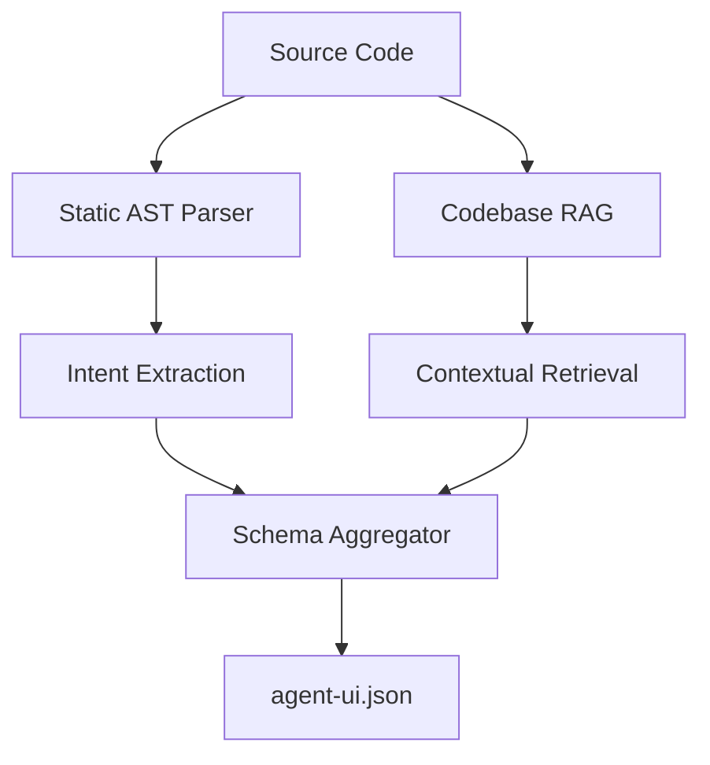

# The OpenUI CLI: Under the Hood

The OpenUI CLI is the reference implementation for generating **Agent-UI JSON** schemas. It utilizes a "RAG-First" architecture to ensure that the generated standard is grounded in the actual source code.

## Architecture: The Semantic Pipeline

### 1. Static AST Parsing
The generator uses Abstract Syntax Trees (AST) to identify interactive elements (buttons, inputs, forms). It doesn't just look for tags; it traces **Event Handlers** and **Props** to understand the *intent* behind the component.

### 2. Codebase RAG (Retrieval-Augmented Generation)
For complex logic, the CLI indexes your codebase. When it encounters a function like `handleSubmit`, it retrieves relevant snippets from your controllers and models to precisely describe the state transition.

### 3. Semantic Classification
Every discovered element is passed through a lightweight semantic classifier (based on `all-MiniLM-L6-v2`) to map code-level names to canonical agent intents (e.g., `handle_auth` -> `login`).

## Key Features

- **Multi-Framework Support**: React, Vue, Angular, Java (Spring), Go, and Ruby on Rails.
- **Deterministic Schema**: Produces a structured logic tree, not a chaotic grid of divs.
- **Developer Directives**: Use `@openui_include` and `// openui-ignore` to fine-tune the standard.

## Usage Guide

For a full list of commands, see the [Usage](../usage.md) section.
